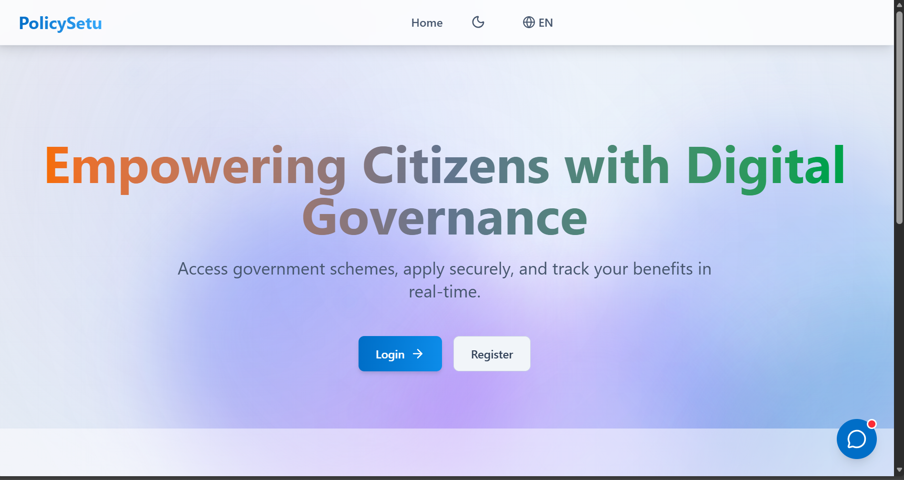
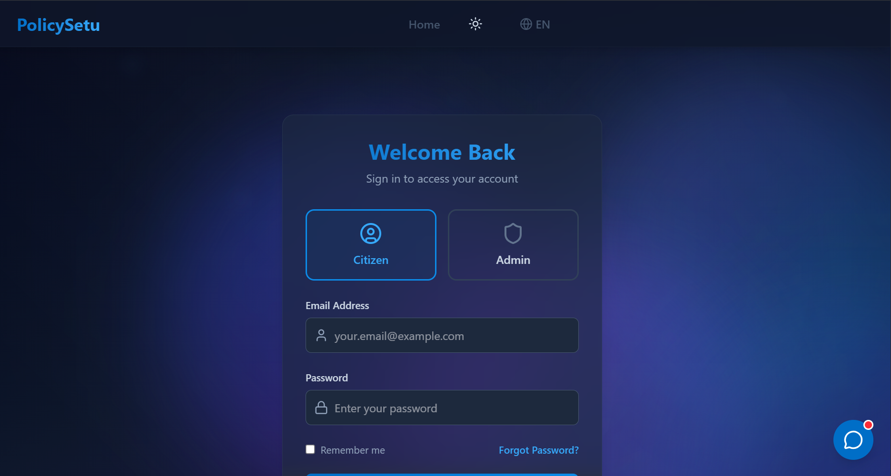
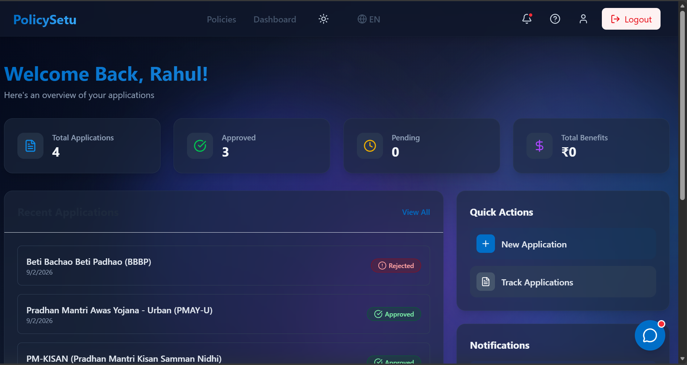
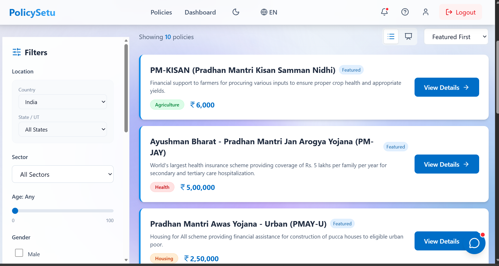
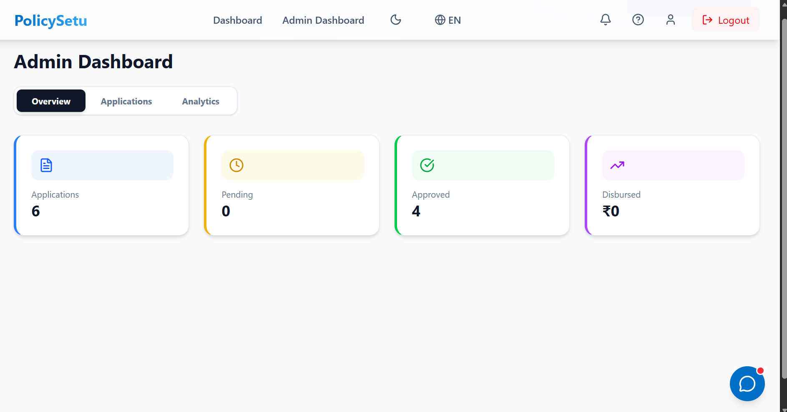
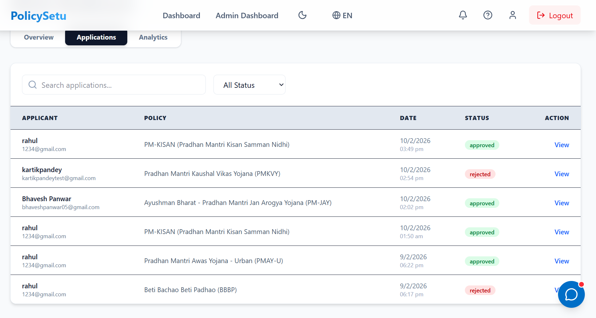

# 🏛️ Digital Governance Platform (PolicySetu)

> A modern, full-stack solution for bridging the gap between government schemes and citizens.

## 📋 Overview

The **Digital Governance Platform** is designed to streamline the process of finding and applying for government policies. It features a robust **Admin Dashboard** for officials to manage applications and a user-friendly interface for citizens to track their benefits.

## ✨ Key Features

-   **🔍 Smart Policy Search**: Filter policies by category, eligibility, and region.
-   **📝 Easy Application**: Streamlined forms for quick policy application.
-   **📊 Real-time Tracking**: Users can track the status of their applications live.
-   **🛡️ Admin Dashboard**: Comprehensive tools for officials to approve/reject applications and view analytics.
-   **🔐 Secure Authentication**: JWT-based authentication for both users and admins.
-   **📱 Responsive Design**: Fully optimized for mobile and desktop devices.

## 📸 Screenshots

| Login & Authentication | User Dashboard |
| :---: | :---: |
|  _Secure login for citizens and admins_ |  _Overview of applications and benefits_ |

| Policy Discovery | Policy Listings |
| :---: | :---: |
| Smart search with filtering_ |  _Detailed policy cards and categories_ |

### Application Tracking

*Real-time status updates and timeline for submitted applications*

### Admin Interface
| Admin Dashboard | Applications Management |
| :---: | :---: |
|  |  |

## 🛠️ Tech Stack

**Frontend:**
*   React.js (Vite)
*   Tailwind CSS (Styling)
*   Framer Motion (Animations)
*   Lucide React (Icons)
*   Axios (API Requests)

**Backend:**
*   Node.js & Express.js
*   Supabase (PostgreSQL Database)
*   JWT (Authentication)

## 🚀 Getting Started

Follow these steps to set up the project locally.

### Prerequisites

*   Node.js (v16+)
*   npm or yarn
*   Git

### 1. Clone the Repository

\`\`\`bash
git clone https://github.com/lakshaybalani14/policysetu.git
cd policysetu
\`\`\`

### 2. Backend Setup

Navigate to the server directory and install dependencies:

\`\`\`bash
cd server
npm install
\`\`\`

Create a \`.env\` file in the \`server\` directory based on the example:

\`\`\`bash
cp .env.example .env
\`\`\`

Update `server/.env` with your credentials.

Start the backend server:

\`\`\`bash
npm run dev
\`\`\`

### 3. Frontend Setup

Open a new terminal, navigate to the frontend directory, and install dependencies:

\`\`\`bash
cd policy-tracker-react
npm install
\`\`\`

Create a \`.env\` file in the \`policy-tracker-react\` directory:

\`\`\`bash
cp .env.example .env
\`\`\`

Update `policy-tracker-react/.env` with your Supabase keys.

Start the frontend development server:

\`\`\`bash
npm run dev
\`\`\`

## 📂 Project Structure

\`\`\`
policysetu/
├── policy-tracker-react/   # Frontend (React + Vite)
│   ├── src/
│   │   ├── components/     # Reusable UI components
│   │   ├── pages/          # Application pages (Dashboard, Home, etc.)
│   │   ├── context/        # Global state (Auth, Theme)
│   │   └── services/       # API integration
│   └── ...
├── server/                 # Backend (Node.js + Express)
│   ├── routes/             # API Routes
│   ├── middleware/         # Auth & Validation Middleware
│   ├── data/               # Mock data / DB connection
│   └── ...
└── README.md               # Project Documentation
\`\`\`

## 🤝 Contributing

Contributions are welcome! Please feel free to submit a Pull Request.

1.  Fork the project
2.  Create your Feature Branch (\`git checkout -b feature/AmazingFeature\`)
3.  Commit your Changes (\`git commit -m 'Add some AmazingFeature'\`)
4.  Push to the Branch (\`git push origin feature/AmazingFeature\`)
5.  Open a Pull Request

## 📄 License

